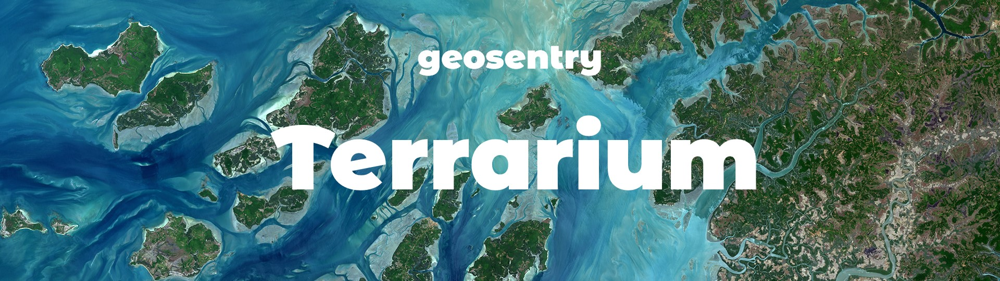

# terrarium

**Terrarium** is a Python Package that contains the **Earth Engine** and GIS related tooling for the the **GeoSentry** 🌍 Platform.

**GeoSentry** is a geospatial observation platform with spectral, topographical and comparative analytics along with a community-curated gallery of stunning satellite imagery powered by ESA's **Sentinel-2** & **Google Earth Engine**.

**Version: 0.2.1**  
**Language: Python 3.9**  
**License: MIT**  
**Status: In Heavy Development**  

## Installation
The package can be installed using ``pip`` with the following command.
```shell
pip install git+https://github.com/geosentry/terrarium#egg=terrarium
```

A specific version of the package can be installed using version. For example, the ``v0.2.1`` tag can be installed using
```shell
pip install git+https://github.com/geosentry/terrarium.git@v0.3.0#egg=terrarium
```

## Background
### Google Earth Engine
**Terrarium** uses the [Earth Engine Python API](https://github.com/google/earthengine-api) for much of its geospatial manipulation functionality and satellite imagery datasources. Google Earth Engine is a planetary-scale platform for Earth science data & analysis that is powered by Google's Cloud Infrastructure and integrates well with Google Cloud Platform.

### Satellite Sources
**Terrarium** is mostly confined to using the European Space Agency's **Sentinel-2 MSI Level-2A** dataset which is corrected for *Surface Reflectance* and available within the Earth Engine Data Catalog with the Collection ID ``COPERNICUS/S2_SR``. The multi-spectral bands of the dataset are used for spectral index generation and false color compositions.  

The *Truecolor* bands available to the L2A collection is also used for generation images, while the SCL band is used for rendering the *Scene Classification Layer* as part of **GeoSentry's** topographical analysis.

Cloudiness values are generated using *Sentinel-2 Cloud Probability* dataset which is also available on the Earth Engine Catalog with the Collection ID ``COPERNICUS/S2_CLOUD_PROBABILITY``.

**Terrarium** also uses JAXA's **ALOS DSM** dataset for altitude based topographical analysis. The dataset is available with the Collection ID ``JAXA/ALOS/AW3D30/V3_2``.

### Asset Generation
!todo

### Authentication
Authentication for the Google Earth Engine API is done using a GCP IAM Service Account and GCP Secret Manager. This auth flow requires 2 Service Accounts.

1. The first service account is created and registed with Earth Engine with the guidelines specified in https://developers.google.com/earth-engine/guides/service_account. 
2. This service account is granted the ``Storage Object Admin`` IAM role to enable asset exports to Cloud Storage Bucket.
2. A credentials key is generated for this service account and stored in GCP Secret Manager. This secret is accessed by this library when the ``initialize()`` function is called.
3. In order to access the secret, another service account is created and granted the ``Secret Manager Secret Accessor`` IAM role.
4. A credential key is generated for the second service account and stored on the local machine/container that uses this **Terrarium**.
5. An environment variable ``GOOGLE_APPLICATION_CREDENTIALS`` is set with the path to the credentials file. Secret Manager uses this path and the file it points to authenticate and access the secret.

**Note**: Cloud Functions and Cloud Run automatically generate a key and set the environment variable based on the service account assoicated with the service.
